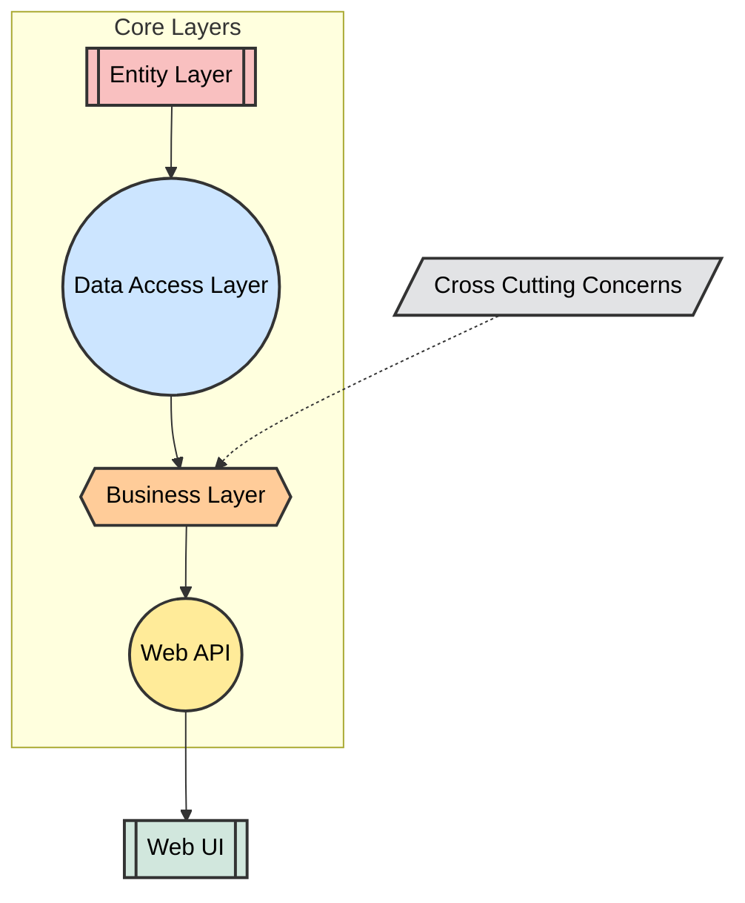

# My Website For [Sabuncu Psikoloji](https://sabuncupsikoloji.com/) 

## Table of Contents
- [Project Overview](#project-overview)
- [📐 Multi-Layered Corporate Architecture](#-multi-layered-corporate-architecture)
  - [1. Entity Layer](#1-entity-layer)
  - [2. Data Access Layer](#2-data-access-layer)
  - [3. Business Layer](#3-business-layer)
  - [4. API Layer](#4-api-layer)
- [🔄 Cross-Cutting Concerns](#-cross-cutting-concerns)
- [🧩 Aspects](#-aspects)
  - [1. Performance Aspect](#1-performance-aspect)
  - [2. Logging Aspect](#2-logging-aspect)
  - [3. Validation Aspect](#3-validation-aspect)
  - [4. Caching Aspect](#4-caching-aspect)
  - [5. Security Aspect](#5-security-aspect)
  - [6. Exception Aspect](#6-exception-aspect)
  - [7. Transaction Aspect](#7-transaction-aspect)


# Project Overview
This project is a combination of a backend developed by me and a pre-made frontend. It aims to provide a seamless user experience by integrating a custom API with a ready-to-use front-end interface.
# 📐 Multi-Layered Corporate Architecture

The project is built on a **multi-layered corporate architecture**. This architecture allows each layer to take on specific responsibilities, making the project more sustainable. Here are the project layers:


## 1. Entity Layer


This layer contains ***data models*** that represent the database tables.

```csharp
// Entity Layer: Concrete/Blog.cs
using SabuncuPsikoloji.Core;
namespace Entity.Concrete
{
    public class Blog : IEntity
    {
        public int Id { get; set; }
        public string Name { get; set; }
        public string Content { get; set; }
        public string BlogUrl { get; set; }
        public string? ImageUrl { get; set; }
    }
}
```
## 2. Data Access Layer

***Database access operations*** are performed in this layer. Using the Repository pattern, data insertion, updating, deletion, and retrieval are carried out.

```csharp
// Data Access Layer: Abstract/IBlogDal.cs
using SabuncuPsikoloji.Entities;
using SabuncuPsikoloji.Core;

namespace SabuncuPsikoloji.DataAccess
{
     public interface IBlogDal : IEntityRepository<Blog>
    {
        Task<Blog> GetBlogByUrl(string blogUrl);
    }
}
```
## 3. Business Layer

This layer contains the ***business rules*** of the application. Data is validated and managed here before processing.

```csharp
// Business Layer: Abstract/IBlogService.cs
using SabuncuPsikoloji.Entities;
using SabuncuPsikoloji.DataAccess;

namespace Business.Abstract
{
    public interface IBlogService
    {
        Task<IDataResult<List<Blog>>> GetAllAsync();
        Task<IDataResult<Blog>> GetAsync(int id);
        Task<IResult> AddAsync(Blog blog);
        Task<IResult> UpdateAsync(Blog blog);
        Task<IResult> DeleteAsync(int id);
        Task<IDataResult<Blog>> GetBlogByUrl(string blogUrl);
    }
}
```

## 4. API Layer

This layer provides the ***connection between the user or client and the business layer***. API endpoints serve the data and manage operations.

```csharp
// API Layer: Controllers/PersonController.cs
using Business.Abstract;
using Entity.Concrete;
using Microsoft.AspNetCore.Authorization;
using Microsoft.AspNetCore.Http;
using Microsoft.AspNetCore.Mvc;

namespace WebAPI.Controllers
{
   
    [Route("api/[controller]")]
    [ApiController]
    public class BlogController : ControllerBase
    {
        private readonly IBlogService _blogService;

        public BlogController(IBlogService blogService)
        {
            _blogService = blogService;
        }


        [HttpGet("GetAll")]
        public async Task<IActionResult> GetAll()
        {
            var result = await _blogService.GetAllAsync();
            if (!result.IsSuccess)
            {
                return BadRequest(result);
            }
            return Ok(result.Data);
        }


        [HttpGet("Get/{id}")]
        public async Task<IActionResult> Get(int id)
        {
            var result = await _blogService.GetAsync(id);
            if (!result.IsSuccess)
            {
                return BadRequest(result);
            }
            return Ok(result.Data);
        }
        
```
The rest can be found in this repository.

## 🔄 Cross-Cutting Concerns

Cross-Cutting Concerns are aspects of a program that affect other layers or components, often requiring a consistent implementation across multiple areas. In a multi-layered architecture, these concerns are usually handled separately to promote modularity and reduce code duplication. Common examples of cross-cutting concerns include:

- **Logging:** Capturing and storing log information for monitoring application behavior and diagnosing issues.
- **Caching:** Storing frequently accessed data to improve performance and reduce the load on backend services.
- **Validation:** Consistently validating input data across various parts of the application to ensure data integrity.




## 🧩Aspects

### 1. Performance Aspect
The Performance Aspect monitors and measures the execution time of methods. By tracking performance metrics, this aspect helps identify slow-running methods, allowing developers to optimize performance and improve the overall efficiency of the application.

### 2. Logging Aspect
The Logging Aspect is responsible for capturing and storing log information during application execution. It logs method calls, parameters, and execution results, providing valuable insights for debugging and monitoring application behavior.

### 3. Validation Aspect
The Validation Aspect enforces data validation rules across the application. This aspect ensures that input data adheres to specific formats and constraints before being processed, helping to maintain data integrity and reduce the risk of errors.

### 4. Caching Aspect
The Caching Aspect improves application performance by storing frequently accessed data in memory. This aspect retrieves data from the cache instead of querying the database, reducing response times and server load while enhancing user experience.

### 5. Security Aspect
The Security Aspect handles authentication and authorization across the application. It ensures that users have the necessary permissions to access certain resources or perform specific actions, enhancing the application's overall security posture.

### 6. Exception Aspect
The Exception Aspect centralizes error handling and management. It captures exceptions thrown by various methods and provides consistent error responses, ensuring that users receive meaningful feedback while maintaining application stability.

### 7. Transaction Aspect
The Transaction Aspect manages database transactions to ensure data consistency and integrity. It wraps method calls in a transaction scope, committing or rolling back changes based on the outcome, thereby maintaining a consistent state within the application.

## License

This project is licensed under the MIT License - see the [LICENSE](LICENSE) file for details.
